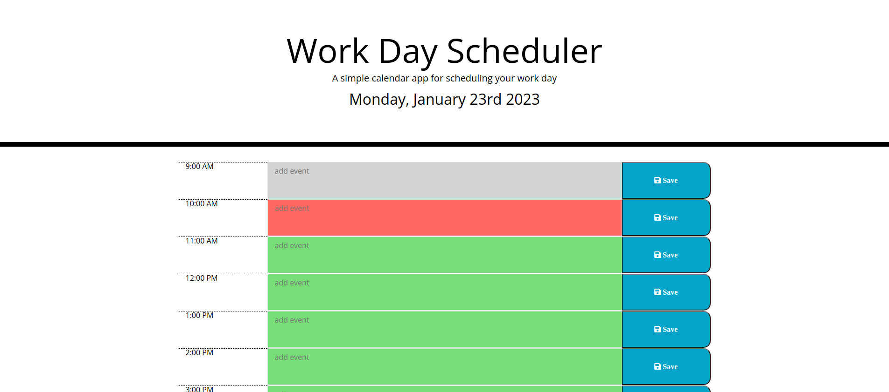

# Daily_Planner_App_EDementieva

## Description

The task in this Challenge is to create a simple calendar application that allows a user to save events for each hour of the day by modifying starter code.

In this Challenge I applied the core skills we've recently learned, such as DOM manipulation, JavaScript and jQuery. I also used the Moment.js library to work with date and time.

The app runs in the browser and features dynamically updated HTML and CSS, all powered by jQuery. The app adapts to multiple screen sizes.

## Installation

N/A

## Usage of the application:

AS AN employee with a busy schedule,
You WANT to add important events to a daily planner,
SO THAT You can manage your time effectively.

The app displays the current day at the top of the calendar when a user opens the planner.

It presents timeblocks for standard business hours when the user scrolls down.

Timeblocks are color-coded based on past, present, and future time.

A user can enter an event when they click a timeblock.

A user can save the event in local storage when the save button is clicked in that timeblock.

Events persist between refreshes of a page.

## Credits

N/A

## License

N/A